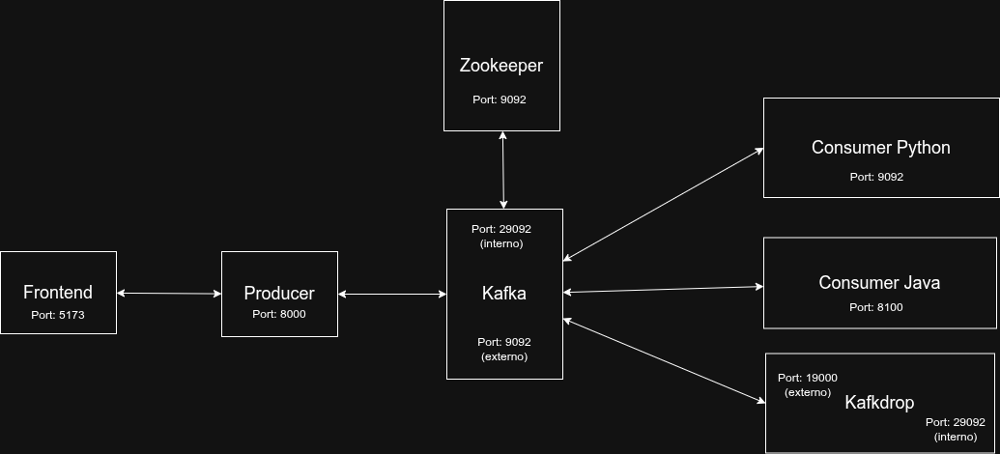

# microservices-kafka-sprint2

Guia rapida para levantar todo el proyecto (Kafka + 2 servicios Spring Boot + frontend React).



## 1. Levantar infraestructura Kafka (Docker Compose)

Desde la carpeta `kafkaExample`:

```bash
cd kafkaExample
docker compose up -d
```

## 2. Levantar el servicio Spring Boot consumidor (`str-consumer`)

En una terminal nueva:

```bash
cd kafkaExample/str-consumer
mvn spring-boot:run
```

Alternativa con wrapper Maven:

```bash
cd kafkaExample/str-consumer
chmod +x mvnw
./mvnw spring-boot:run
```

Puerto esperado: `8100`.

## 3. Levantar el servicio Spring Boot productor (`str-producer`)

En otra terminal nueva:

```bash
cd kafkaExample/str-producer
mvn spring-boot:run
```

Alternativa con wrapper Maven:

```bash
cd kafkaExample/str-producer
chmod +x mvnw
./mvnw spring-boot:run
```

Puerto esperado: `8000`.

## 4. Levantar el frontend React (`frontProducerDoctors`)

En otra terminal nueva:

```bash
cd frontProducerDoctors
npm install
npm run dev
```

Abre la URL que muestra Vite (normalmente `http://localhost:5173`).

## 5. Orden recomendado de arranque

1. `docker compose up -d`
2. `str-consumer`
3. `str-producer`
4. `frontProducerDoctors`

## 6. Consumer Python (opcional)

En otra terminal nueva:

```bash
cd kafkaExample/python-consumer
python3 -m venv .venv
source .venv/bin/activate
pip install -r requirements.txt
python consumer.py --from-beginning
```

En Windows (PowerShell):

```powershell
cd kafkaExample/python-consumer
python -m venv .venv
.venv\Scripts\Activate.ps1
pip install -r requirements.txt
python consumer.py --from-beginning
```

Para consumir topicos especificos:

```bash
python consumer.py --topics unsc-topic covenant-topic flood-topic --group-id python-extra-consumer
```

## 7. Detener todo

1. Deten los servicios Spring Boot con `Ctrl + C` en sus terminales.
2. Baja Docker Compose:

```bash
cd kafkaExample
docker compose down
```
